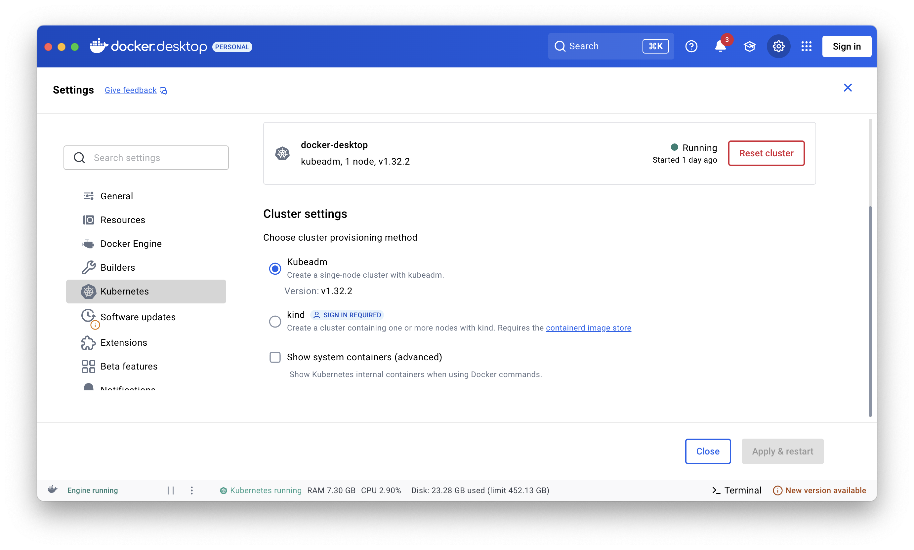
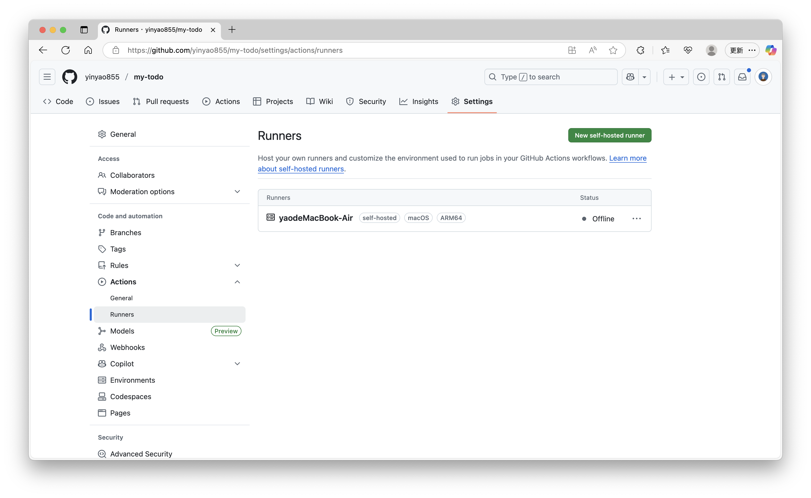
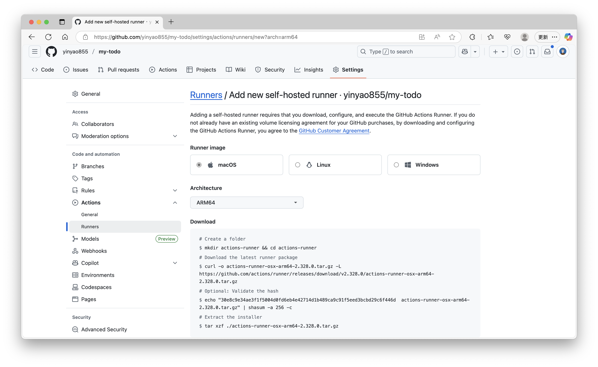

# Todo 应用 - SpringBoot + Vue + K8s

这是一个基于SpringBoot + Vue的Todo应用，支持部署到Kubernetes集群中。

## 功能特性

### 1. 任务增删改查（基础核心）
- ✅ 添加新任务（标题 + 内容 + 截止时间）
- ✅ 编辑任务
- ✅ 删除任务
- ✅ 查看所有任务列表

### 2. 任务状态管理
- ✅ 标记任务为"未完成/已完成"
- ✅ 支持按状态筛选（全部/未完成/已完成）
- ✅ 已完成任务显示删除线

### 3. 任务优先级设置
- ✅ 创建任务时可选择优先级（高/中/低）
- ✅ 列表按优先级排序

### 4. 简单用户认证
- ✅ 登录/注册功能
- ✅ 每个用户仅能查看自己的任务
- ✅ 简单密码验证

### 5. 任务到期提醒
- ✅ 登录后自动提示"24小时内到期的未完成任务"

## 技术架构

### 后端技术栈
- **Spring Boot 3.5.5** - 主框架
- **Spring Data JPA** - 数据访问层
- **MySQL 8.0** - 数据库
- **Maven** - 依赖管理

### 前端技术栈
- **Vue 3** - 前端框架
- **Vue Router** - 路由管理
- **Element Plus** - UI组件库
- **Axios** - HTTP客户端
- **Day.js** - 日期处理
- **Vite** - 构建工具

### 部署技术
- **Docker** - 容器化
- **Kubernetes** - 容器编排
- **Nginx** - 反向代理

## 快速开始

### 本地开发

可以执行`start-local.sh`脚本或按照以下步骤启动：

#### 1. 启动MySQL数据库
```bash
# 使用Docker启动MySQL
docker run -d \
  --name mysql-todo \
  -e MYSQL_ROOT_PASSWORD=rootpassword \
  -e MYSQL_DATABASE=todo_db \
  -e MYSQL_USER=todo_user \
  -e MYSQL_PASSWORD=password \
  -p 3306:3306 \
  mysql:8.0

# 执行初始化脚本
mysql -h localhost -P 3306 -u root -prootpassword < database/init.sql
```

#### 2. 启动后端服务
```bash
cd backend/mytodo
mvn clean dependency:resolve
mvn spring-boot:run -Dspring-boot.run.arguments="--spring.profiles.active=dev"
```

#### 3. 启动前端服务
```bash
cd frontend/mytodo
npm install
npm run dev
```

### 访问应用
- 前端: http://localhost:5173
- 后端API: http://localhost:8080
- 默认用户: admin / 123456

## 部署到Kubernetes

### 1. 安装依赖
确保安装项目所需的依赖
```bash
cd backend/mytodo
mvn clean dependency:resolve
cd ../../
cd frontend/mytodo
npm install
cd ../../
```

### 2. 构建Docker镜像
由于要构建镜像，请保证网络畅通✈️
```bash
chmod +x build-images.sh
bash ./build-images.sh
```

### 3. 部署到K8s
```bash
# 确保kubectl已配置
chmod +x deploy.sh
bash ./deploy-k8s.sh
```

### 4. 访问应用
```txt
访问 http://localhost:30080
```

### 5. 从k8s中删除应用
```bash
chmod +x uninstall-k8s.sh
bash ./uninstall-k8s.sh
```

## CI/CD流水线
如果使用jenkins进行CI/CD有困难，推荐使用GitHub Actions，参考`.github/workflows`目录下的配置文件。

该项目使用本地Runner实现自动化流水线，如需要查看CI/CD的效果，请fork本仓库，然后点击仓库的Settings -> Actions -> Runners，按照提示安装Runner。

## 项目关键点说明

### 1. docker环境和k8s环境搭建

- 推荐使用`Docker Desktop`，提供内置的k8s功能，适合本地开发和测试


- 也可以使用`minikube`，可以快速的创建一个单节点集群，见[Minikube官方文档](https://minikube.sigs.k8s.io/docs/start/)

- 使用云厂商提供的k8s服务，如阿里云的ACK，腾讯云的TKE等

### 2. 项目如何容器化

容器化的重点是分离配置以及编写Dockerfile，下面以springboot项目和vue项目为例

对于springboot项目，要改写[application.properties](backend/mytodo/src/main/resources/application.properties)项目配置文件，改为使用环境变量配置数据库连接等信息，对于前端，要改写`axios`的请求地址，改为请求后端服务的域名，见[index.js](frontend/mytodo/src/api/index.js)

```js
// 根据环境判断API基础路径
const isDevelopment = process.env.NODE_ENV === 'development' || import.meta.env.DEV
const API_BASE_URL = isDevelopment 
  ? 'http://localhost:8080/api' 
  : '/api'

const api = axios.create({
  baseURL: API_BASE_URL,
  timeout: 10000
})
```

这个地方路径之所以是`/api`，是因为我们使用了`nginx`作为前端的反向代理服务器，见[nginx.conf](frontend/nginx.conf)，会将`http://localhost:30080/api/**`开头的请求转发到后端服务地址`http://todo-backend:8080/**`，其中`todo-backend`是k8s中后端服务的名称

然后是编写Dockerfile文件，这部分比较简单，见[backend/Dockerfile](backend/Dockerfile)和[frontend/Dockerfile](frontend/Dockerfile)

### 3. 项目如何部署到k8s

部署到k8s的重点是编写k8s的配置文件，见[k8s](k8s)目录下的配置文件，主要包括以下资源：
- 部署描述文件：[deployment.yaml](k8s/mysql-deployment.yaml)
- 配置文件：[configmap.yaml](k8s/mysql-configmap.yaml)
- 密钥文件：[secret.yaml](k8s/mysql-secret.yaml)

主要是指定服务的名称、使用的镜像、端口、环境变量等信息，需要注意的是服务的端口以及类型，见[k8s 四种Service类型](https://blog.csdn.net/weixin_53269650/article/details/140924623)，由于我们是本地开发测试，所以使用`NodePort`类型，可以通过`localhost:30080`访问前端服务，而后端和数据库服务一般不暴露给用户，所以使用`ClusterIP`类型，只在集群内部可见

### 4. 搭建CI/CD流水线

可以使用`GitHub Actions`，`Jenkins`等工具搭建CI/CD流水线，本项目使用`GitHub Actions`，见[.github/workflows](.github/workflows)目录下的配置文件

如何安装自己的`GitHub Actions Runner`?



在项目设置页面点击`Actions`，然后点击`Runners`，点击`New self-hosted runner`，按照提示安装Runner



## 写在最后

有任何问题都可以询问助教，但是助教也不保证全都会，相信你们biubiubiu的创造力🥳

## 许可证

MIT License 